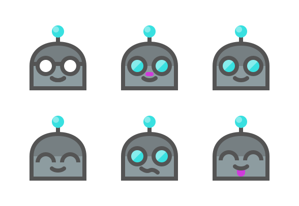
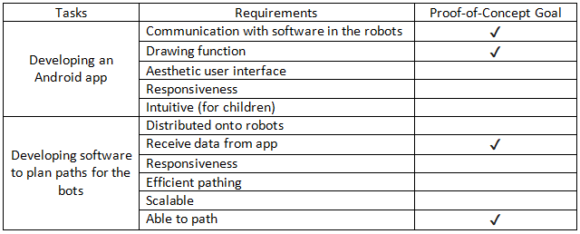
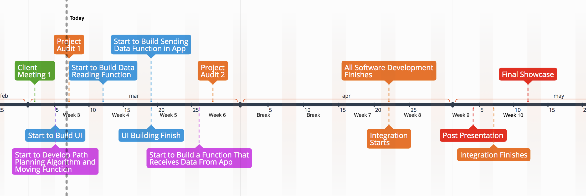
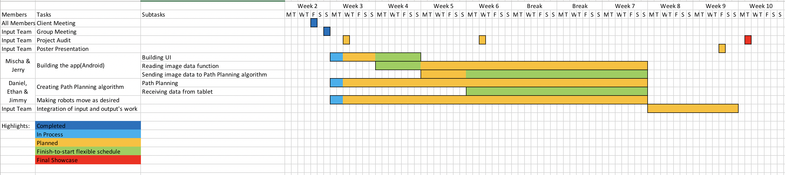

# Pixel-bots Project (Input Team)

# Pixel-bots interactive demonstration for Questacon in Canberra, Australia

## Acknowledgement
Here to acknowledge the great work of the  ANU FIFTY50 Online Mentoring Platform done by Nitika and her team, where we developed our landing page based on theirs as template. 

## Background & Questacon's Vision
Questacon is The National Science and Technology Centre. It contains an enormous range of exhibits, shows, and activities designed to appeal to both adults and children alike, and inspire creativity and learning. Questacon’s purpose is to encourage curiosity and a desire to discover more. 

Questacon had an idea for an exhibit that they really liked, to get robots forming user-defined shapes on a wall. However, they did not have excess people to bring their creation to life. This is where we come in, we were tasked with creating the bots and making them work for Questacon.

## Introduction
The project is to build an interactive picture drawing display for Questacon’s upcoming AI and Robotics exhibit. This will be done to highlight and emphasize swarm mechanics to an audience. The way that this exhibit will adhere to Questacon’s educational values will be by creating a picture made up of bots in front of the user, based on a picture drawn by the user. The pattern can be multi-coloured with a pixel art style. Once completed we hope to create an effect that could almost considered ‘the picture coming to life’, due to the fast movement required to assemble the picture. With these features combined, it will create a fun and interactive display for people to use. 

## Team Members and Communications
| Name       |       Role     | Description  |
| ---------------|-------------| --------------|
| Boyi Chen     |Integration lead  | Overseas the project management exchanges information between two teams of the project |
| Ethan Stanbury      | Software Lead     |Overseas the software development and provides technical supports for the team|
| Yuge Shi| Communicator/Software Assistant    | Communicates with output team and integrates both teams' work|
|Mischa Rippon|App Developer| Develops an Android app for client| 
|Daniel Jang| Software Assistant| Assist in developing the software|

Our team uses Discord, Slack and Facebook Messenger for communication, and uses GitHub to store our software solutions. Most of our communications relating to the project is done through Slack, but Facebook Messenger serves as a good second alternative in case team members are unable to be reached via Slack. We have at least one team meetings every week to discuss and work on the project and to ensure we are fulfiling course requirements. We will use GitHub to work on our software, as GitHub provides great tools to aid the software development (such as issue tracking and commit history).

We use email as our communication method with the Client representative.

## Project Requirements
There are two major tasks in the Input team’s project. One is to develop the app on an Android tablet such that children can draw an image on it. Another is to develop a software to plan every robot’s path to form the shape drawn on the tablet. 
The proof-of-concept column shows the requirements which are necessary for the proof-of-concept at the end of the semester (as this project will likely take the whole year). These are the highest priority to be completed, but we will attempt to complete as many of the goals as possible in the time frame.
The requirements for each part are listed in the table below:

## Stakeholders
Stakeholder analysis was done and documented in our [repository](https://drive.google.com/drive/folders/1vXUeWAJI2woFL61KtNDHRchhf66X0r6w?usp=sharing).

* Client - Doug Newton-Walters from Questacon
* Input Team
* Output Team
* End Users
* Shadows
* Tutors
* Course Convenor

## Project Timeline
We have planned out our schedule for the project. The timeline below shows our milestone through the project process.

We have also planned out our schedule for detailed tasks to reach our milestone. The Gantt Chart shows the time assigned to each task. The highlighs are explained in the chart. The green highlight means the finish-to-start process that the lower (shown in the chart) task will start as the upper task finishes.

You can track the spreadsheet version of our timeline for our current progress via the following link:
https://drive.google.com/drive/folders/1ftPz0-EDVKlvwMVM_vQRAPd-yqdJM8Ru

## Action List
We have built a Google Sheet to record assigned actions of each week's task of the project.
Head to our action list: <https://docs.google.com/spreadsheets/d/19gmH4mP4hD4nWEzPY1URRG5i9sr1kFOTp_vyLgnJJ1s/edit?usp=sharing>

## Find Our Code & Documentations
### GitHub Repository 
Our source code is stored at: 
https://github.com/jerryboyichen/Pixel-bots-ANU

### Google Drive
1. [Root Folder](https://drive.google.com/open?id=1JHoB5Bd2yHia9Jg5V82wV7BwvhNvdjXE) is where we store all the documentation of the project.
2. [Tutor Meetings](https://drive.google.com/drive/folders/1QgvB4En2anAMBNLpiJ6aV1oIa1cbZK3A?usp=sharing) contains tutor meeting mintues for the project.
3. [Client Meetings](https://drive.google.com/open?id=1xPIl5xHOdwIqY9ny28ZxOdskIVeK-5FL) contains information of the client meeting such as project requirements, deliverables, etc.
4. [Team Weekly Meetings](https://drive.google.com/open?id=1QMasybzRh-uwbFAWl5xqPoCUiwzv2rZ8) contains our weekly meeting mintues. 
5. [Input/output Team Integration Meetings](https://drive.google.com/open?id=17hAL3vyZUWkxl5sNfAlr0Oqf4uwvtK87) records the information of the Project Teams meeting.

### Resource Identification

### Risk Identification
* Stakeholders become disengaged or fail to support project 
* Delays due to learning curves of acquiring new skills
* Scope is ill defined
* Stakeholders have inaccurate expectations
* Unforeseen and uncontrolled situations

### Potential Cost
The total budget for two teams of the Pixel Bots Project is around $30k ~ $40k. For our input team, we don't have significant 

### Tools for software development (tentative)
The software development tools depends on the board using on our robots. Here are some potential development tools for us to consider:

* Android Studio <https://developer.android.com/studio/index.html>
* Visual Studio <https://www.visualstudio.com>
* Buzz: A Programming language designed for robot swarms <http://the.swarming.buzz>
* Platformio <https://platformio.org>

### Tools for documentation
We use following tools to document and manage our progress:

* Google Drive <https://www.google.com/drive/>
* Google Doc <https://docs.google.com/>
* TimeGraphisc <https://time.graphics>

### NDA and IP Agreement
Our team has expressed our concerns about NDA and IP agreement with client. Doug is going to consult the legal team at Questacon. 
Client requires that the repository to be private (not open to public). The repository will be available for all stakeholders mentioned from previous **Stakeholders** section. 

## Contact
If you are a member within any stakeholder groups and don't have access to any links above, please contact Boyi Chen by emaling  u5794300@anu.edu.au.

